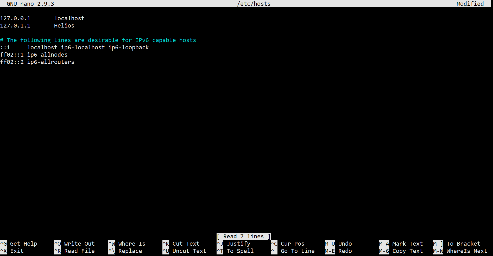

# Unable to resolve host

### Introduction
You may notice when you run sudo or any commands that you may see a small message that comes and says "Sudo: unable to resolve host", this means that the hostname doesn't match what was defined in the hosts file, this is a simple fix that will be explained and listed below.


### How to fix
First, you should check the hostname file and see if that matches the hostname you have set. 
```bash
sudo cat /etc/hostname
```


You can also see the hostname as it comes after your username e.g root@Helios.
Keep the output of the previous command as you will be using that in the next step!

Next, we will be checking the hosts file to make sure that the vps knows what the new hostname is.
```bash
sudo nano /etc/hosts
```
The default file would be this or a similar looking one:

You want to edit it to resemble this:


!!! note
    In my case it was Ubuntu -> Helios
    
    To exit from nano use Ctrl + X and Y to save the edited text.

!!!tip
    Don't fancy using nano? you can use the command below.

    sed -i 's/ubuntu/newhost/' /etc/hosts 

    If host is not ubuntu replace ubuntu to whatever it was shown.
