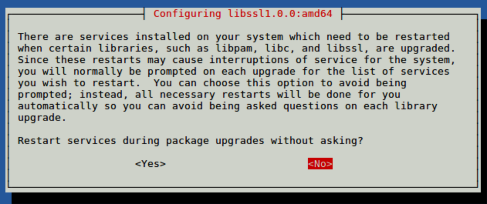
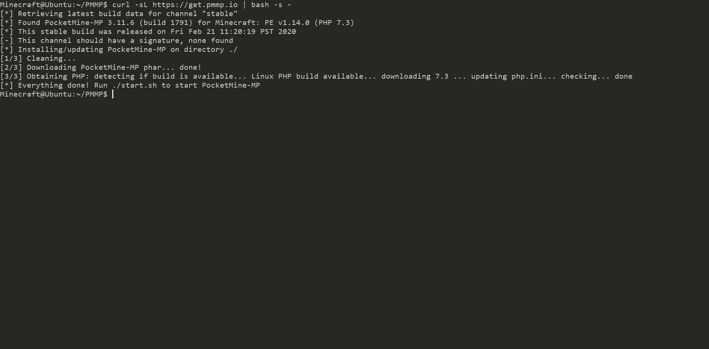
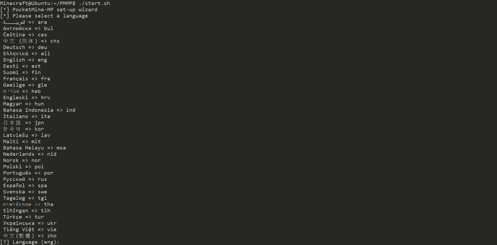
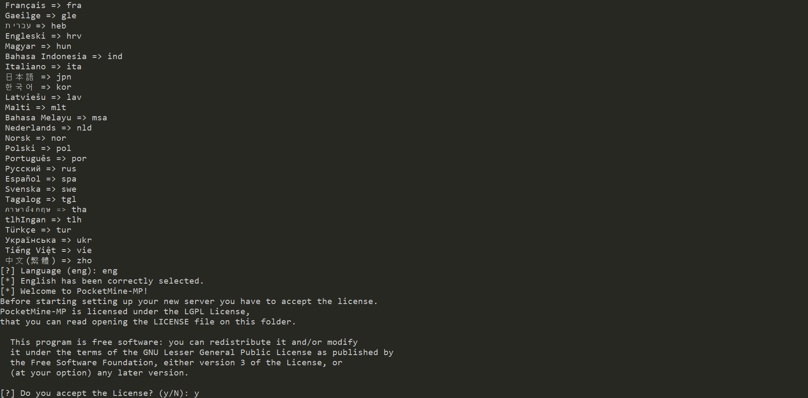
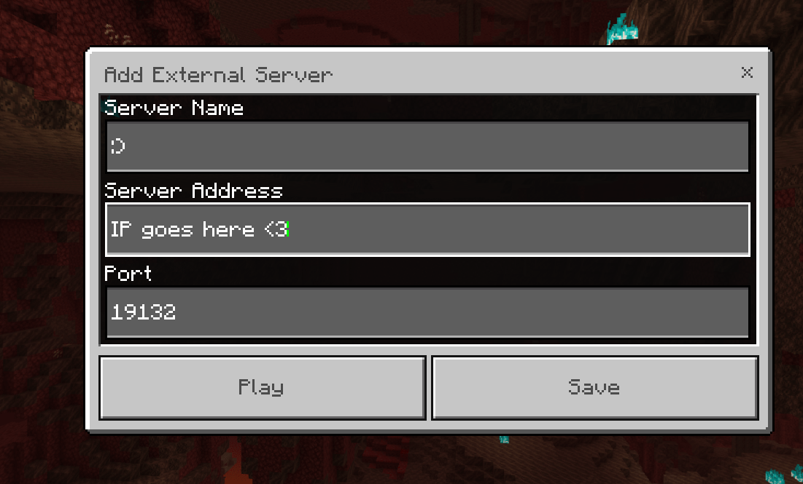
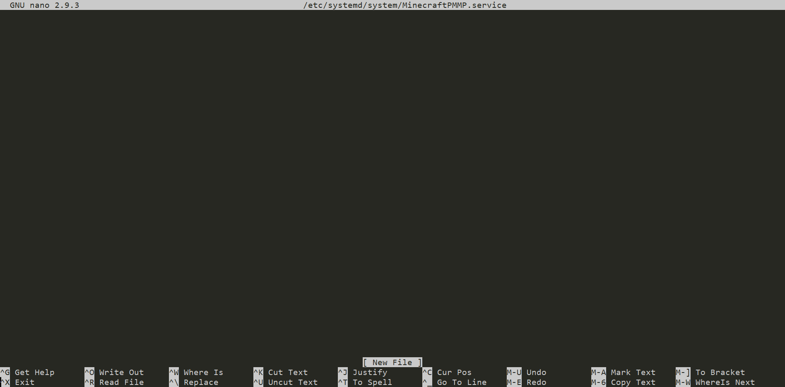
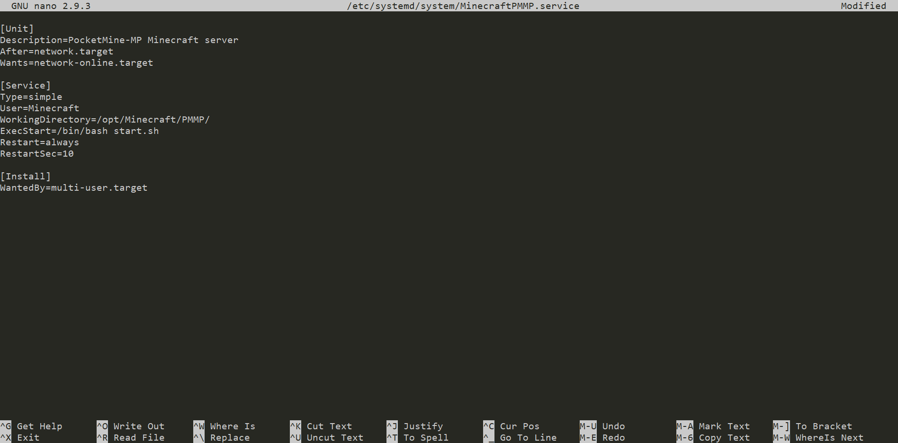

# Hosting a PocketMine-MP Server

## Introduction
In this guide, you will be able to host a PocketMine-MP Minecraft server as well as keeping it alive without having to be logged in all the time. Before you start, make sure you meet the requirements and have a basic understanding of Linux, if you have issues or are stuck on a step you can ask for help in our [support server.](https://discord.gg/jcKEyxn)

## Requirements 
* You have a Linux VPS (Debian/Ubuntu).
* You are logged in as root or have a user that can use sudo.
* You know how to establish an SSH connection or use an SSH client.
<br/>

*Don't know how to connect to your server? Check out this [guide.](../../../basics/first_login.md)*

## Installing required packages
I recommend that you should be logged in as root before executing these commands to ensure everything goes smoothly.

```
apt update && apt upgrade -y 
apt install sudo screen unzip curl -y 
```
!!! warning 
    You may get a popup like the one below, use the arrow key to click yes to proceed.


## Creating a user for Minecraft
For security purposes, Minecraft should not be running under the root user. We will create a new system user and group with home directory /opt/Minecraft that will run the Minecraft server:

```
sudo useradd -r -m -U -d /opt/Minecraft -s /bin/bash Minecraft
```
We are not going to set a password for this user. This is a good security practice because this user will not be able to log in via SSH. To login to the Minecraft user, you’ll need to be logged in to the server as root or user with sudo privileges.

Before starting with the installation process, make sure you switch to the Minecraft user.

```
sudo su - Minecraft
```
## Creating the Directory 
If you plan to have multiple versions of Minecraft running I would recommend creating a folder for them to make sure the files do not conflict.
```
mkdir PMMP
cd PMMP
```

## Using the installer
The PocketMine-MP team has kindly made a script that will automatically install the server for you.
```
curl -sL https://get.pmmp.io | bash -s -
```


## Starting the server
Execute the command below in the same directory you ran the installer script in.
```
./start.sh
```
This will ask you to start configuring your server which you should fill in yourselves.




## Connecting to the server
The server IP should be provided after you finish the setup however In the eventuality that you do not have the IP you can still use the commands listed below to find your IP.
```
dig +short myip.opendns.com @resolver1.opendns.com
```
!!! Note
    If the command above fails, try this command and copy the output as that is the IP of your server.

    ```curl icanhazip.com```
 Copy the IP and open Minecraft up, go to servers and click add a server and under `Server Address` put the server's IP in and click Done.
 

## Keeping your server alive
### Screen

Screen is one way of keeping your server running in the background without having to keep your SSH session open.

!!! warning
    `screen` does not boot on load or write logs to the disk automatically, reboots would kill the screen due to only being a virtual session.

To start your server with screen, first, make sure you have `screen` package installed.

#### Installation
You should've installed screen from the start of the guide. In the eventuality that you do not have `screen package` installed, please use the command below and make sure you're using root or sudo. You can install screen using the one-liner below:
```bash
sudo apt update && sudo apt install screen -y
```
!!! warning
    Make sure you are using root if you are still on the Minecraft account use `exit`, then execute the commands after you are done you should use the command listed to switch back to the Minecraft account `sudo su - Minecraft`.
#### Usage
You can then start your server by using the command below:
```bash
screen -S PMMP -L ./start.sh
```
This should create a session you can safely leave without fear of it shutting down when you leave. 
You can leave the screen via `CTRL+AD` from this session so your Server is still online when you leave.

You can re-attach to the running screen by running `screen -r PMMP` and either issue commands or shutdown the server via `CTRL+C`.

### Systemd
Systemd can be an easy way of keeping your Minecraft server up, setting a service file for Minecraft should be easy and quick if you follow closely, first you should switch to root for this by running the command below.
#### Installation
```
exit
```
Once you are root we will start by creating a service file called `MinecraftPMMP.service` in `/etc/systemd/system/`.
```
nano /etc/systemd/system/MinecraftPMMP.service
```
Next, a screen like this will show up, you will fill it up with the config provided below.

Use this config.
```ini
[Unit]
Description=PocketMine-MP Minecraft server
After=network.target
Wants=network-online.target

[Service]
Type=simple
User=Minecraft
WorkingDirectory=/opt/Minecraft/PMMP/
ExecStart=/bin/bash start.sh
Restart=always
RestartSec=10

[Install]
WantedBy=multi-user.target
```


!!! Hint
    To exit out of nano, use Ctrl + X and hit Y

Run the commands below to test and start the server
```
systemctl daemon-reload 
systemctl start MinecraftPMMP.service 
systemctl status MinecraftPMMP.service
systemctl enable MinecraftPMMP.service
```
#### Usage
Here are some commands that will help you effectively manage the service.
Start service:
```
systemctl start MinecraftPMMP.service 
```
Restart service:
```
systemctl restart MinecraftPMMP.service 
```
Status of service:
```
systemctl status MinecraftPMMP.service 
```
Stop service:
```
systemctl stop MinecraftPMMP.service 
```
View logs:
```
journalctl -n 50 -f -u MinecraftPMMP.service
```

## Resources
* [PocketMine-MP Documentation](https://pmmp.readthedocs.io/en/rtfd/)<br>
* [PocketMine-MP Github](https://github.com/pmmp/PocketMine-MP)<br>
* [Discord](https://discord.gg/bmSAZBG)<br>
* [Forums](https://forums.pmmp.io/)<br>
* [StackOverFlow](https://stackoverflow.com/tags/pocketmine)<br>
* [Docker Image](https://hub.docker.com/r/pmmp/pocketmine-mp)<br>
* [Plugin repository](https://poggit.pmmp.io/plugins)