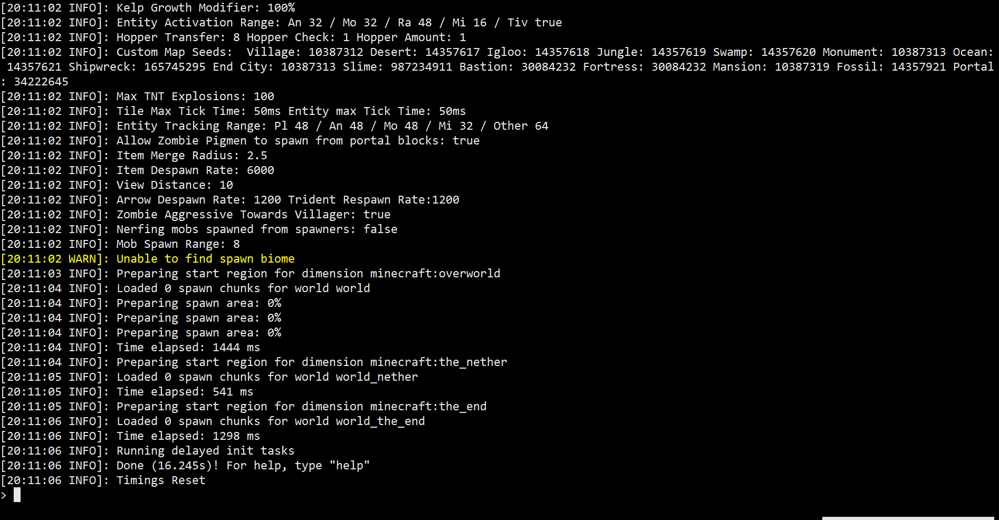
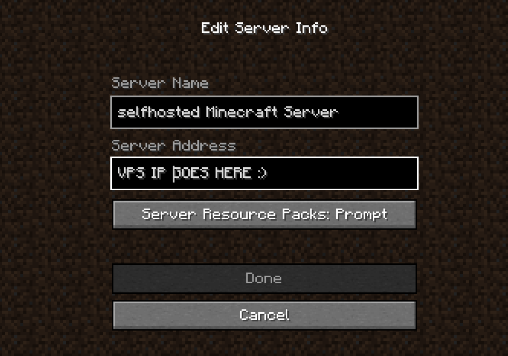
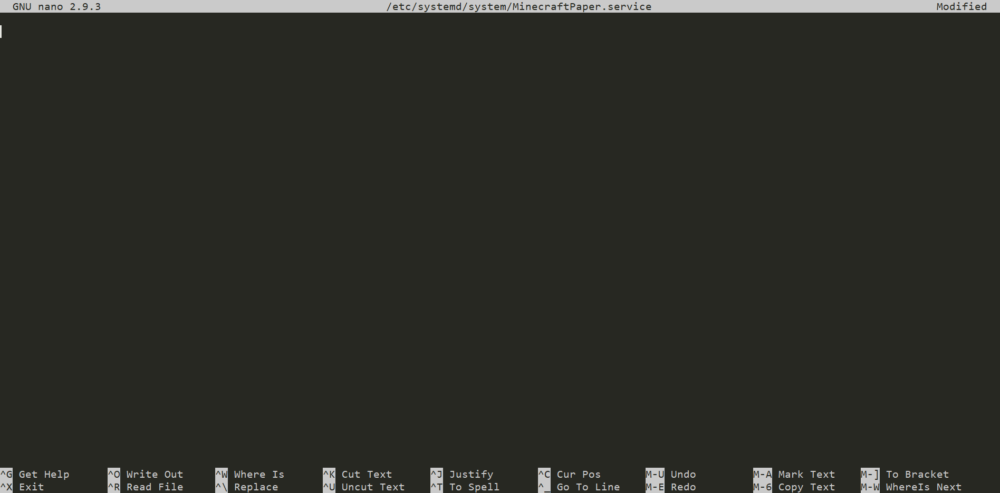
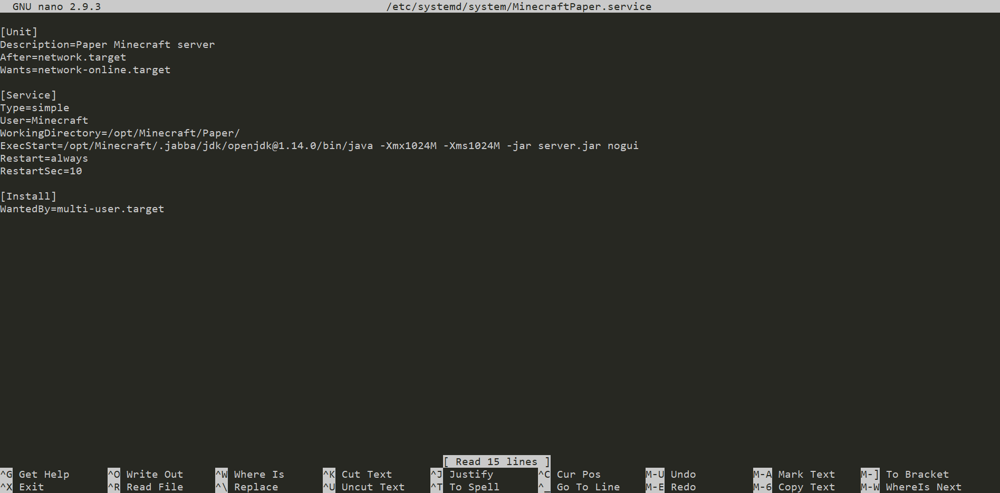

# Hosting a Paper Minecraft server

## Introduction
In this guide, you will be able to host a Paper Minecraft server as well as keeping it alive without having to be logged in all the time. Before you start, make sure you meet the requirements and have a basic understanding of Linux, if you have issues or are stuck on a step you can ask for help in our [support server.](https://discord.gg/jcKEyxn)

## Requirements 
* You have a Linux VPS (Debian/Ubuntu).
* You are logged in as root or have a user that can use sudo.
* You know how to establish an SSH connection or use an SSH client.
<br/>

*Don't know how to connect to your server? Check out this [guide.](../../../basics/first_login.md)*

## Installing required packages
I recommend you should be logged in as root before executing these commands to ensure everything goes smoothly.

```
apt update && apt upgrade -y 
apt install sudo screen unzip curl -y 
```
!!! warning 
    You may get a popup like the one below, use the arrow key to click yes to proceed.

## Creating a user for Minecraft
For security purposes, Minecraft should not be running under the root user. We will create a new system user and group with home directory /opt/Minecraft that will run the Minecraft server:

```
sudo useradd -r -m -U -d /opt/Minecraft -s /bin/bash Minecraft
```
We are not going to set a password for this user. This is a good security practice because this user will not be able to log in via SSH. To login to the Minecraft user, you’ll need to be logged in to the server as root or user with sudo privileges.

Before starting with the installation process, make sure you switch to the Minecraft user.

```
sudo su - Minecraft
```

## Creating the Directory 
If you plan to have multiple versions of Minecraft running I would recommend creating a folder for them to make sure the files do not conflict.
```
mkdir Paper
cd Paper
```

## Installing Java
Run the commands below on the Minecraft user we created above.
```
curl -sL https://github.com/shyiko/jabba/raw/master/install.sh | bash && . ~/.jabba/jabba.sh
jabba install openjdk@1.14.0
jabba alias default openjdk@1.14.0
```
!!! Information 
    Run `jabba` to see if was installed correctly. 
## Getting the server jar
Please download one of the server Jars from below. Currently, 1.16 is the latest server jar.

1.16
```
wget https://papermc.io/ci/job/Paper-1.16/lastStableBuild/artifact/paperclip.jar -O server.jar
```
1.15.2
```
wget https://papermc.io/api/v1/paper/1.15.2/143/download -O server.jar
```
1.14.4
```
wget https://papermc.io/api/v1/paper/1.14.4/243/download -O server.jar
```
1.13.2
```
wget https://papermc.io/api/v1/paper/1.13.2/655/download -O server.jar
```
1.12.2
```
wget https://papermc.io/api/v1/paper/1.12.2/1618/download -O server.jar
```

!!! information
    Don't see the version you are looking for? you can grab the server jar from this [website](https://papermc.io/legacy)

## Running the server
First, make sure you do have java installed by running `java` and make sure you have the server jar file by running `ls` and you should see `server.jar` or the file you downloaded, to run the server run the command below once.
```
java -Xmx1024M -Xms1024M -jar server.jar nogui
```
You will get a message asking you to accept the EULA.


To accept the EULA just edit eula.txt and change false to true.
```
nano eula.txt
```
Before:

After:


!!! note
    To exit from nano use Ctrl + X and Y to save the edited text.
Next, you can run the same command again to start the server.
```
java -Xmx1024M -Xms1024M -jar server.jar nogui
```
!!! Hint
    server.jar might include numbering depending where you have downloaded your jar from, you can also increase the ram used by upping the Xmx and Xms flags.


## Connecting to the server
You should grab the IP of your server which can be found using the command below if you do not know it.

```
dig +short myip.opendns.com @resolver1.opendns.com
```
!!! Note
    If the command above fails, try this command and copy the output as that is the IP of your server.

    ```curl icanhazip.com```
 Copy the IP and open Minecraft up, go to servers and click add a server and under `Server Address` put the server's IP in and click Done.
 

## Keeping your server alive
### Screen

Screen is one way of keeping your server running in the background without having to keep your SSH session open.

!!! warning
    `screen` does not boot on load or write logs to the disk automatically, reboots would kill the screen due to only being a virtual session.

To start your server with screen, first, make sure you have `screen` package installed.

#### Installation
You should've installed screen from the start of the guide. In the eventuality that you do not have `screen package` installed, please use the command below and make sure you're using root or sudo. You can install screen using the one-liner below:
```bash
sudo apt update && sudo apt install screen -y
```
!!! warning
    Make sure you are using root if you are still on the Minecraft account use `exit`, then execute the commands after you are done you should use the command listed to switch back to the Minecraft account `sudo su - Minecraft`.
#### Usage
You can then start your server by using the command below:
```bash
screen -S Paper -L java -Xmx1024M -Xms1024M -jar server.jar nogui
```
This should create a session you can safely leave without fear of it shutting down when you leave, 
You can leave the screen via `CTRL+AD` from this session so your Server is still online when you leave.

You can re-attach to the running screen by running `screen -r Paper` and either issue commands or shutdown the server via `CTRL+C`.
### Systemd
Systemd can be an easy way of keeping your Minecraft server up, setting a service file for Minecraft should be easy and quick if you follow closely, first you should switch to root for this by running the command below.
#### Installation
```
exit
```
Once you are root we will start by creating a service file called `MinecraftPaper.service` in `/etc/systemd/system/`.
```
nano /etc/systemd/system/MinecraftPaper.service
```
Next, a screen like this will show up, you will fill it up with the config provided below.

Use this config.
```ini
[Unit]
Description=Paper Minecraft server
After=network.target
Wants=network-online.target

[Service]
Type=simple
User=Minecraft
WorkingDirectory=/opt/Minecraft/Paper/
ExecStart=/opt/Minecraft/.jabba/jdk/openjdk@1.14.0/bin/java -Xmx1024M -Xms1024M -jar server.jar nogui
Restart=always
RestartSec=10

[Install]
WantedBy=multi-user.target
```


!!! Hint
    To exit out of nano, use Ctrl + X and hit Y

Run the commands below to test and start the server
```
systemctl daemon-reload 
systemctl start MinecraftPaper.service 
systemctl status MinecraftPaper.service
systemctl enable MinecraftPaper.service

```
#### Usage
Here are some commands that will help you effectively manage the service.
Start service:
```
systemctl start MinecraftPaper.service 
```
Restart service:
```
systemctl restart MinecraftPaper.service 
```
Status of service:
```
systemctl status MinecraftPaper.service 
```
Stop service:
```
systemctl stop MinecraftPaper.service 
```
View logs:
```
journalctl -n 50 -f -u MinecraftPaper.service
```
## Resources
* [PaperMC Documentation](https://paper.readthedocs.io/en/latest/)<br>
* [PaperMC Github](https://github.com/PaperMC)<br>
* [Discord](https://discord.gg/papermc)<br>
* [Plugin repository](https://dev.bukkit.org/bukkit-plugins)